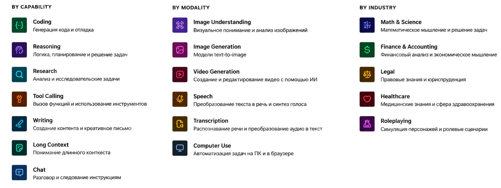

# От ноутбука до multi-GPU
## Инфраструктура и софт для локального запуска LLM

Практический алгоритм выбора инструментов для локального запуска LLM (август 2026)

- Что запускать, на чём, сколько стоит и как обслуживать

---
layout: default
---

# Где уже используется AI?

AI в 2026 году вышел далеко за пределы чата. Сценарии, которые уже работают:

<v-clicks>

- **Код** — генерация, ревью, тесты
- **Текст и документы** — чаты, ИИ-поиск и поиск по документации
- **Агенты** — автоматизация рабочих задач
- **Транскрибация и голос** — Whisper, голосовые ассистенты
- **Медиа** — фото и видео

> Кто использует AI во всех сценариях? Ежедневно?

</v-clicks>

---
layout: default
---

# Сколько стоит «бесконечный» AI?

#### Подписки ChatGPT:

|                                    | **Free**              | **Go**         | **Plus**              | **Pro**                           |
| ---------------------------------- | --------------------- | -------------- | --------------------- | --------------------------------- |
| **Цена**                           | **$0**                | **$8/мес.***   | **$20/мес.**          | **$100 или $200/мес.**            |
| **Основная модель**                | GPT-5.6 Luna          | GPT-5.6 Luna   | GPT-5.6 Sol           | GPT-5.6 Sol / **Sol Pro**         |
| **Reasoning / Think**              | **Luna Think**        | **Luna Think** | **Sol — Medium/High** | **Sol — до Extra High + Sol Pro** |
| **Обычные текстовые чаты**         | Безлимит*             | Безлимит*      | Безлимит*             | Безлимит*                         |
| **Лимит основной модели**          | Ограниченный для Free | Выше Free      | Существенно выше      | **5× / 20×** относительно Plus    |
| **Контекст / память**              | Ограниченные          | Расширенные    | Более расширенные     | Максимальные                      |
| **Deep Research**                  | Ограниченный          | Ограниченный   | Расширенный           | Максимальный                      |
| **Codex**                          | Ограниченный          | Ограниченный   | Расширенный           | Максимальный                      |
| **Скорость ответа**                | Ограниченная          | Ограниченная   | Быстрая               | Быстрая                           |
| **Приоритет при высокой нагрузке** | ❌                     | Выше Free      | ✅                     | ✅                                 |
| **Реклама**                        | **Может быть**        | **Может быть** | **Нет**               | **Нет**                           |

---
layout: default
---

# 429: Too Many Requests

<v-clicks>

  

> ### Как часто вы сталкивались с этой ошибкой?

</v-clicks>

---
layout: default
---

# Models API: оплата за токены
<v-clicks>

Альтернатива подпискам — оплата только за использованные ресурсы (API).

| Модель | Input/1M Tokens | Output/1M Tokens |
|---|---|---|
| **GPT-5.6 Sol** | ~$4.00 | ~$20.00 |
| **GPT-5.6 Terra** | ~$2.00 | ~$12.00 |
| **Claude Sonnet 5** | ~$2.00 | ~$10.00 |
| **Claude Opus 5** | ~$5.00 | ~$25.00 |

> 1M токенов = ~1500 страниц A4 с текстом 12pt шрифта Arial (англ.яз.)

> **Подписка или Models API?**

</v-clicks>

<!--
- **Подписка:** Выгодна при интенсивном ручном использовании (чат), но скрывает реальные лимиты (динамические ограничения, ошибки 429) и размер доступного контекста.
- **Models API:** Вы платите за каждый токен. Это дороже для активного чата, но даёт гарантию доступа (без неожиданных 429), полный контекст (до 200k) и возможность автоматизации (агенты).

- https://openai.com/business/pricing/#api
- https://platform.claude.com/docs/en/about-claude/pricing
-->

---
layout: center
---

# Оплата

<v-clicks>

> Кто пытался оплатить зарубежный AI-сервис с юрлица в РФ за последний год?

  

</v-clicks>

---
layout: default
---

# Models API: оплата за токены

Альтернатива подпискам — оплата только за использованные ресурсы (API).

| Модель | Input/1M Tokens | Output/1M Tokens |
|---|---|---|
| **GPT-5.6 Sol** | ~$4.00 | ~$20.00 |
| **GPT-5.6 Terra** | ~$2.00 | ~$12.00 |
| **Claude Sonnet 5** | ~$2.00 | ~$10.00 |
| **Claude Opus 5** | ~$5.00 | ~$25.00 |
| **GLM 5.1 (Cloud.ru)** | **~$3.00** | **~$10.00** |

<!--
- **Подписка:** Выгодна при интенсивном ручном использовании (чат), но скрывает реальные лимиты (динамические ограничения, ошибки 429) и размер доступного контекста.
- **Models API:** Вы платите за каждый токен. Это дороже для активного чата, но даёт гарантию доступа (без неожиданных 429), полный контекст (до 200k) и возможность автоматизации (агенты).

- https://openai.com/business/pricing/#api
- https://platform.claude.com/docs/en/about-claude/pricing
-->

---
layout: default
---

# Риск утечки

<v-clicks>

> Кто хотя бы раз отправлял код, пароли, логи или персданные в СhatGPT/Claude?

  

</v-clicks>

---
layout: default
---

# Зачем локально? Три драйвера в РФ

1. **Контроль**
   - Версия модели, квантизация, промпты — без сюрпризов от провайдера
   - "Купил и забыл"
2. **Безопасность и закон**
   - ФЗ-152, КИИ, коммерческая тайна. Утечка = риск
3. **Автономность**
   - Изолированно
   - Без лимитов
   - Без риска блокировки

---
layout: section
---

# Модели

---
layout: default
---

# Классы моделей

- **Tiny (≤4B)**
  - Edge-устройства, on-device запуск, простые задачи
  - Qwen3.5 4B, Phi-5 Mini, Gemma 4 E4B
  - VRAM: <8 ГБ
- **Small (4B–40B)**
  - Лучший баланс для агентов и кодинга
  - **Qwen3.8-27B**, **Qwen3.6-35B-A3B**, Laguna XS 2.1, North Mini Code 1.0, Ornith 1.5, Muse-Glimmer-30B 
  - VRAM: >16 ГБ
- **Medium (40B–150B)**
  - Cложная логика, продвинутый кодинг, отличный reasoning
  - Laguna S 2.1, MAI-Code-1-Flash 
  - VRAM: >32 ГБ
- **Large (>150B)**
  - Серверный уровень, замена проприетарным API
  - DeepSeek-V4-Pro, Tencent Hy3, Nemotron 3 Ultra, Kimi K3, Qwen 3.8 Max, Minimax M3
  - VRAM: >128 ГБ

---
layout: default
---

# Как выбирать модель

  

 

> Оценивайте не только оценку по бенчам, но и производительность на вашем железе, лицензию и реальные отзывы по деградации при квантизации.

---
layout: section
---

# Софт для запуска моделей

---
layout: default
---

# Софтверный стек

- **Личное использование:**
  - `Ollama` (самый простой старт), `LM Studio` (удобный GUI).
- **Максимальный контроль / Apple / CPU:**
  - `llama.cpp` (база для большинства инструментов).
- **Production / multi-user:**
  - `vLLM` (PagedAttention) или `SGLang` (особенно для agentic + prefix-heavy + MoE).
- **Apple Silicon:**
  - `MLX` + `Ollama`.

**Инфраструктура для Аудио/Фото/Видео:** `Whisper`, `Stable Diffusion`, `ComfyUI`

---
layout: default
---

# Инфраструктура вокруг

- **Воспроизводимость:** Docker.
- **Память и RAG:** 
  - Vector DB: Qdrant, pgvector, Chroma
  - Агентная память: Hindsight, mem0
- **Шлюз:** OpenAI-compatible endpoint (LiteLLM, Portkey, Bifrost, CLIProxyAPI)
  - Подключение агентов и мониторинг запросов (токены/с, latency)
- **MCP**
- **WebUI:** OpenWebUI, 
- **Квантизация ([разбираемся с суфиксами](https://habr.com/ru/articles/918936/)):**
  - `Q4_K_M` - золотой стандарт баланса качества и размера:
    - 70B: 130GB (fp16) -> 40GB (q4)
  - `MLX-4bit` — Apple
  - `NVFP4` - новые NVIDIA (архитектура Blackwell)

<!--

layout: two-cols

# Prefill vs Decode — критический концепт

**Prefill (обработка промпта)**
- Compute-bound (зависит от TFLOPS / Tensor Cores).
- Чтение всего контекста разом.

**Decode (генерация токенов)**
- Memory-bound (зависит от пропускной способности памяти — GB/s).
- Токен за токеном.

> Для одного пользователя и «печатного» вывода важнее **GB/s**, а не терафлопсы.

::right::

### Примеры Bandwidth (ГБ/с)

- **RTX 3090** ≈ 936 ГБ/с
- **RTX 4090** ≈ 1008 ГБ/с
- **RTX 5090** ≈ 1792 ГБ/с
- **M4 Max** ≈ 546 ГБ/с
- **M3 Ultra** ≈ 819 ГБ/с
-->

---
layout: section
---

# Железо

---
layout: default
---

# Железо — 4 ценовые категории

1. **Бюджет (до 100 тыс. ₽)**
   - RTX 3060 12 ГБ, мини-ПК с NPU, мощный CPU
   - *Тянет: 7–14B*
2. **Народный (100–200 тыс. ₽)**
   - RTX 3090 24 ГБ, Mac M4 Pro 36 ГБ
   - *Тянет: 14–32B*
3. **Рабочая станция (200–600 тыс. ₽)**
   - RTX 5090 32 ГБ
   - 128 ГБ: NVIDIA DGX Spark, Mac Studio, AMD Ryzen Max+ 395
   - *Тянет: 70B + несколько сервисов*
4. **Enterprise (от 600 тыс.)**
   - Multi-GPU, A100/H100, Huawei Atlas 300i/Duo, RTX PRO 6000
   - *Тянет: тяжёлые MoE + высокий параллелизм и контекст*

---
layout: default
---

# Детали по железу

- **RTX 3090 24 ГБ б/у:** лучшее соотношение цена/VRAM (≈ 3.8 тыс. ₽/ГБ).
- **RTX 5090 32 ГБ:** ≈ 390–490 тыс. ₽, bandwidth 1792 ГБ/с, TDP 575 Вт.
- **Apple Silicon (Mac Studio, Mac Pro):** unified memory = запуск моделей, не влезающих в одну GPU.
  - *Нюанс:* bandwidth ниже топовых RTX → медленнее decode.
- **AMD Ryzen Max+ 395:** тоже unified memory.
- **Multi-GPU:** электричество + требования к охлаждению и БП.

<!--
# Алгоритм принятия решения (чек-лист)

<v-clicks>

1. **Безопасность / контур?** (Нужна ли полная изоляция?)
2. **Задача → класс модели** (Выбор через профильные бенчмарки).
3. **Требования к железу:** VRAM + bandwidth + concurrency.
4. **Экономика:** Токены × API vs CapEx + электричество.
5. **Софтверный стек:** Ollama (просто) → vLLM/SGLang (production).
6. **Железо:** Подбор под бюджет и задачу.
7. **Кто обслуживает?** (Наличие экспертизы в команде).

</v-clicks>
-->

---
layout: default
---

# Краткие рекомендации «что брать прямо сейчас»

- **Один разработчик / ноутбук:**
  - Mac M4 Pro 24+ ГБ + Qwen3.6-35B-A3B + MLX/Ollama.
- **Команда / небольшой сервер:**
  - 1–2× RTX 5090 32 ГБ + Qwen3.8-27B + vLLM/SGLang.
- **Корпоративный контур:**
  - Multi-GPU A100/H100 80+ ГБ + vLLM/SGLang.

---
layout: default
---

# Итоги

- Локальный LLM — это про **контроль, безопасность и предсказуемость**, а не про «максимальное качество любой ценой».
- В 2026 году открытые модели (особенно Qwen и DeepSeek-линейки) уже закрывают **80–90 % повседневных IT-задач** на доступном железе.
- Главное — считать экономику и выбирать стек под реальную нагрузку.

---
layout: q-and-a
---

# Q&A
