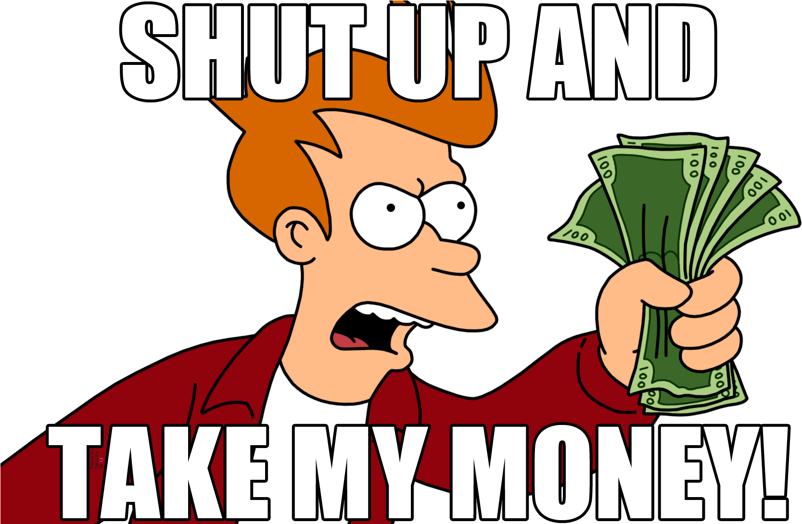
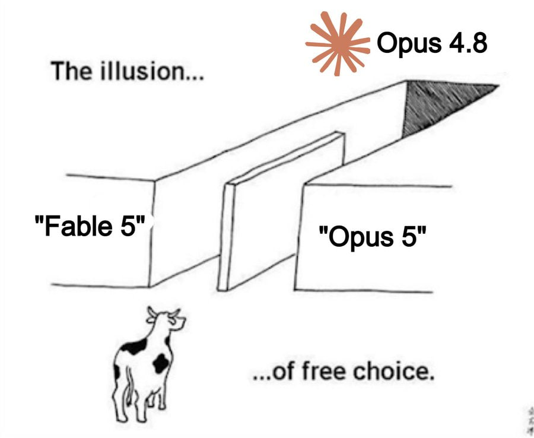
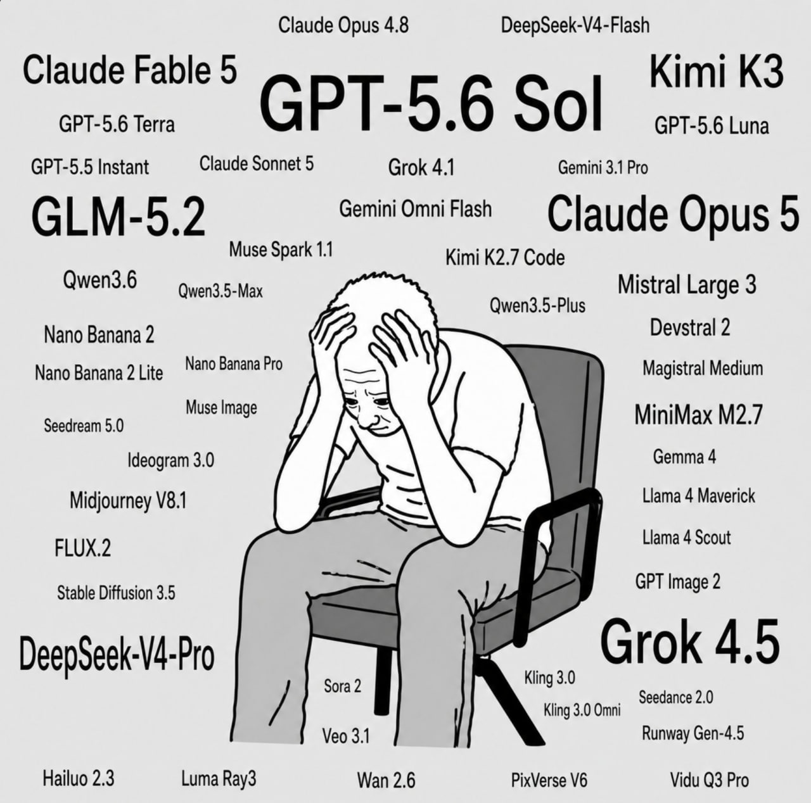
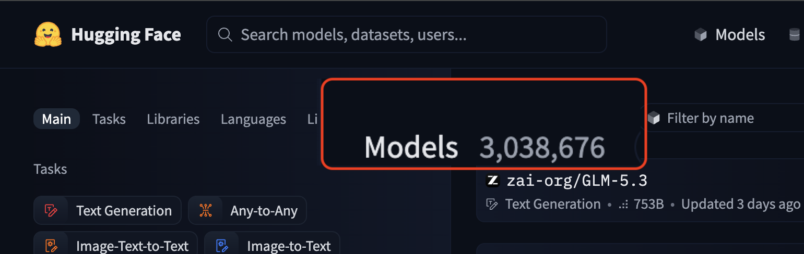
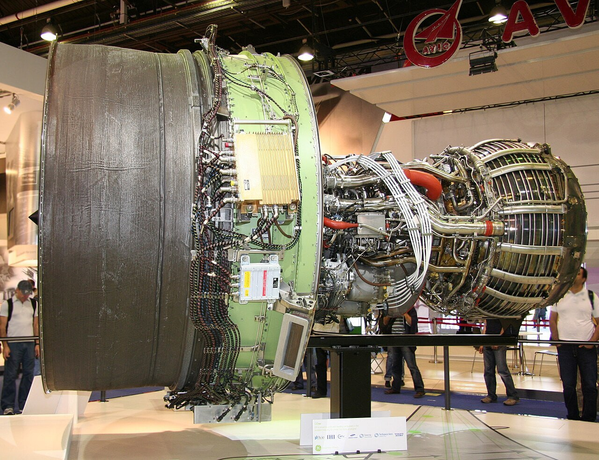

# От ноутбука до multi-GPU
## Инфраструктура и софт для локального запуска LLM

Практический алгоритм выбора инструментов для локального запуска LLM (август 2026)

- Что запускать, на чём, сколько стоит и как обслуживать

---
layout: section
---

# А зачем?

---
layout: default
---

# Где уже используется AI?

AI в 2026 году вышел далеко за пределы чата. Сценарии, которые уже работают:

<v-clicks>

- **Код** — генерация, ревью, тесты
- **Текст и документы** — чаты, ИИ-поиск и поиск по документации
- **Агенты** — автоматизация рабочих задач
- **Транскрибация и голос** — Whisper, голосовые ассистенты
- **Медиа** — фото и видео

> Кто использует AI во всех сценариях? Ежедневно?

</v-clicks>

---
layout: image
image: /assets/pay-variants.png
backgroundSize: contain
---

---
layout: center
---

<v-clicks>

  

</v-clicks>

---
layout: center
---

# Советские стандарты качества

---
layout: image
image: /assets/abliterated-lora.png
backgroundSize: contain
---

---
layout: default
---

# Зачем локально?

1. **Контроль**
   - Версия модели и квантизация
   - Без сюрпризов от провайдера
2. **Безопасность и закон**
   - ФЗ-152, КИИ, коммерческая тайна. Утечка = риск
3. **Автономность и доступность**
   - Изоляция
   - Без лимитов
   - Без риска блокировки
4. **Кастомизация**
   - Дообучение и модель под задачу

---
layout: section
---

# Выбор модели

---
layout: center
---

# Трудности выбора модели

---
layout: center
---

# Сколько всего моделей на Hugging Face?

<v-clicks>

</v-clicks>

---
layout: image
image: /assets/model-classification.png
backgroundSize: contain
---

---
layout: default
---

# Где смотреть рейтинги моделей?

При выборе модели для реальных задач стоит опираться на независимые лидерборды:

  

    <h3 class="font-bold"><a href="https://arena.ai/leaderboard/code/webdev/fullstack" target="_blank">arena.ai</a></h3>
    

      Слепые A/B-тесты (LMSYS Chatbot Arena). Специализированный лидерборд для webdev и fullstack-разработки.
    

  

  

    <h3 class="font-bold"><a href="https://llm-stats.com/leaderboards/best-ai-for-coding" target="_blank">llm-stats.com</a></h3>
    

      Сводная статистика и актуальный рейтинг лучших моделей для написания и рефакторинга кода.
    

  

  

    <h3 class="font-bold"><a href="https://artificialanalysis.ai/models#intelligence-breakdown" target="_blank">artificialanalysis.ai</a></h3>
    

      Независимый бенчмарк качества (intelligence breakdown), скорости инференса (токены/сек) и стоимости.
    

  

  
На что обращать внимание:

  <ul class="mt-1 space-y-1 text-gray-600">
    <li><strong>Coding & Agentic benchmarks:</strong> оценивайте тесты на реальном коде, а не синтетические метрики.</li>
    <li><strong>Соотношение качество / размер:</strong> для локального запуска критичен баланс VRAM и скорости.</li>
  </ul>

---
layout: image
image: /assets/kimi-k3-score.png
backgroundSize: contain
---

---
layout: image
image: /assets/self-hosted-kimi.png
backgroundSize: contain
---

---
layout: image
image: /assets/big-isnot-better.jpg
backgroundSize: contain
class: bg-black
---

---
layout: section
---

# Софт

---
layout: image
image: /assets/soft-for-llm.png
backgroundSize: contain
---

---
layout: section
---

# Железо

---
layout: default
---

# 4 ценовые категории

1. **Ультрабюджет (до 100 тыс. ₽)**
2. **Народный (100–200 тыс. ₽)**
3. **Рабочая станция (200–600 тыс. ₽)**
4. **Enterprise (от 600 тыс. ₽)**

---
layout: image
image: /assets/work-hardware.png
backgroundSize: contain
class: bg-black
---

---
layout: center
---

# Почему не серверные GPU?

  
  

---
layout: collage
---

  

  

  

  

  

  

---
layout: default
---

# Краткие рекомендации

- **Один разработчик / ноутбук:**
  - Mac M4 Pro 24+ ГБ + Qwen3.6-35B-A3B + MLX/Ollama
- **Команда / небольшой сервер:**
  - 1–2× RTX 5090 32 ГБ + Qwen3.8-27B + vLLM/SGLang
- **Корпоративный контур:**
  - Multi-GPU A100/H100 80+ ГБ + ... + vLLM/SGLang

---
layout: section
---

# Итоги

---
layout: default
---

# Итоги

- Локальный LLM — это про **контроль, безопасность и предсказуемость**, а не про «максимальное качество любой ценой».
- В 2026 году открытые модели уже закрывают **80% повседневных IT-задач** (см. harness).
- Главное — считать экономику и выбирать стек под реальную нагрузку.

---
layout: image
image: /assets/the-end-qr.png
backgroundSize: contain
class: bg-black
---

  <h2 class="font-bold">
    <a href="http://t1-lampa.gainanov.pro/"
       target="_blank"
       style="position: absolute; top: 400px; left: 95px;">
      t1-lampa.gainanov.pro
    </a>
  </h2>

---
layout: q-and-a
---